# **Traffic Sign Recognition**

---

**Build a Traffic Sign Recognition Project**

The goals / steps of this project are the following:
* Load the data set (see below for links to the project data set)
* Explore, summarize and visualize the data set
* Design, train and test a model architecture
* Use the model to make predictions on new images
* Analyze the softmax probabilities of the new images
* Summarize the results with a written report

## Rubric Points
### Here I will consider the [rubric points](https://review.udacity.com/#!/rubrics/481/view) individually and describe how I addressed each point in my implementation.  

---

Here is a link to my [project code](https://github.com/Hotsuyuki/CarND-Traffic-Sign-Classifier-Project/blob/master/Traffic_Sign_Classifier.ipynb)

### Data Set Summary & Exploration

#### 1. Provide a basic summary of the data set.

I used the numpy library to calculate summary statistics of the traffic
signs data set:

* The size of training set is 34799
* The size of the validation set is 4410
* The size of test set is 12630
* The shape of a traffic sign image is (32, 32, 3)
* The number of unique classes/labels in the data set is 43

#### 2. Include an exploratory visualization of the dataset.

Here is an exploratory visualization of the data set. It is a bar chart showing how the train, validation and test dataset is distributed.

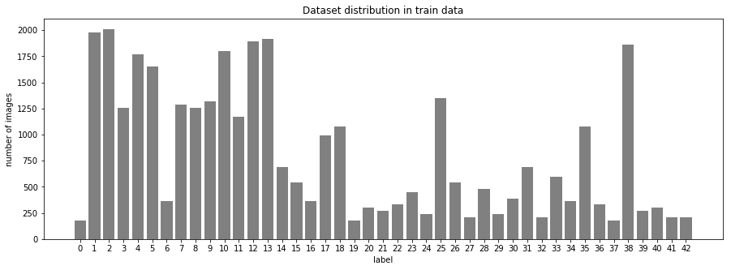

The distribution of the train dataset  

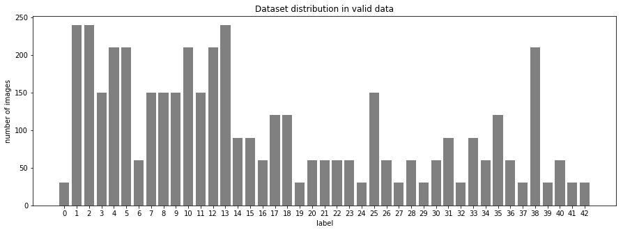

The distribution of the valid dataset  

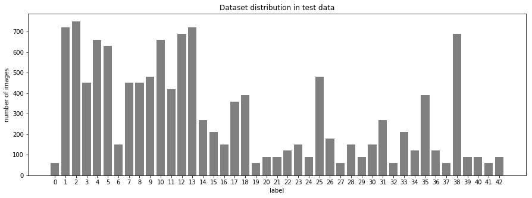

The distribution of the train dataset  

The distributions of these dataset are similar each other, that implies both validation and test dataset might be retrieved from same train dataset.

### Design and Test a Model Architecture

#### 1. Describe how you preprocessed the image data. What techniques were chosen and why did you choose these techniques? Consider including images showing the output of each preprocessing technique. Pre-processing refers to techniques such as converting to grayscale, normalization, etc.

As a first step, I decided to augment the train images by Rotating, Translating, Zooming and Flipping because augmenting dataset would reduce overfitting of the model. However, we should be aware not to lose the characteristics of the original images thorough the augmenting process.

* Rotating: Counter-Clock-Wise, Clock-Wise...15[deg] each

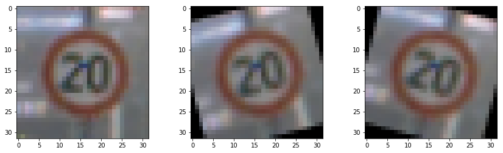

Rotating  

* Translating: Top-Left, Top-Right, Bottom-Left, Bottom-Right...2[pixel] each

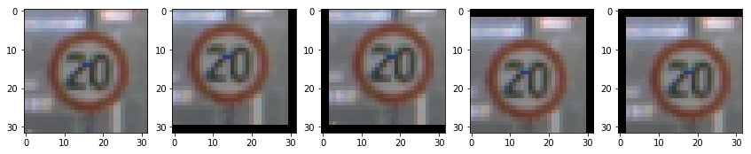

Translating  

* Zooming: Up, Down...2[pixel] each

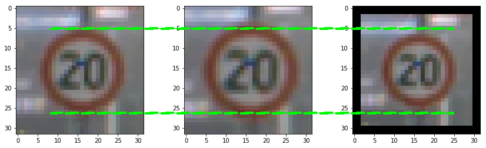

Zooming  

Flipping augmentation is little tricky. There are 4 types of images that can be flipped.

1. Images which are same appearance even after horizontal flipping... e.g. *[11] "Right-of-way at the next intersection"*
2. Images which are same appearance even after vertical flipping... e.g. *[1] "Speed limit (30km/h)""*
3. Images which are same appearance even after both horizontal and vertical flipping (180[deg] rotaion)... e.g. *[32] "End of all speed and passing limits"*
4. Images which change to other traffic sign after horizontal flipping... e.g. *[33] "Turn right ahead"* → *[34] "Turn left ahead"*

Here is an example of a traffic sign image before and after flippin.

* Flipping: Horizontally, Vertically, Both(180[deg] rotation), Cross

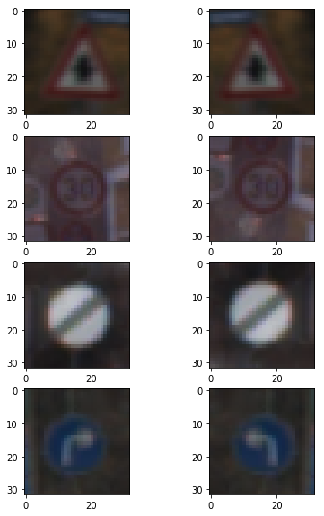

Flipping  

Finally, the images were augmented by a factor of 9.6.

I then grayscaled the train images. [This paper](http://yann.lecun.com/exdb/publis/pdf/sermanet-ijcnn-11.pdf) indicates that color information is not so important to classify images, even sometimes without color is better than using color.

* Grayscaling:

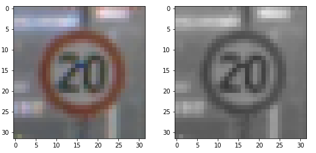

Grayscaling  

As a last step, I normalized the image data to arrange the range of the input features. If we have 2 kinds of features which have different range, one ranges -90 ~ 90 like *degree* and the other one ranges 0 ~ 1 like *probability*, then the former feature would be more weighted and the latter one would not affect to the neural network so much. Moreover, inputs which has large range might make neurons saturated, and weights would not get updated to small values. Thus, the inputs have to be normalized before feeding to gradient based algorithm.

* Normalizing:

  `X_train = (X_train - np.mean(X_train)) / np.std(X_train)`
  `X_valid = (X_valid - np.mean(X_valid)) / np.std(X_valid)`
  `X_test = (X_test - np.mean(X_test)) / np.std(X_test)`

#### 2. Describe what your final model architecture looks like including model type, layers, layer sizes, connectivity, etc.)

I used the architecture introduced in this article, [Traffic signs classification with a convolutional network](https://navoshta.com/traffic-signs-classification/). My final model consisted of the following layers:

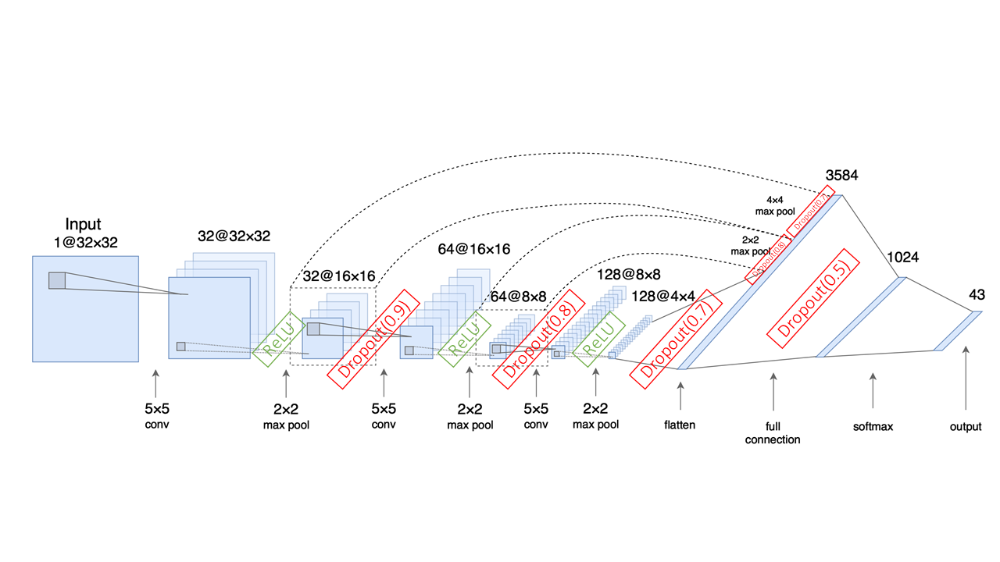

The architecture of the model  

| Layer         	| Description	        					              |
|:---------------:|:-------------------------------------------:|
| Input         	| 32x32x1 Grayscale image   							    |
| Convolution 5x5	| 1x1 stride, SAME padding, outputs 32x32x32	|
| RELU				  	|												                      |
| Max pooling	   	| 2x2 stride, VALID padding, outputs 16x16x32	|
| Dropout	      	| keep probability = 0.9                      |
| Convolution 5x5	| 1x1 stride, SAME padding, outputs 16x16x64	|
| RELU				  	|												                      |
| Max pooling	   	| 2x2 stride, VALID padding, outputs 8x8x64	  |
| Dropout	      	| keep probability = 0.8                      |
| Convolution 5x5	| 1x1 stride, SAME padding, outputs 8x8x128	  |
| RELU				  	|												                      |
| Max pooling	   	| 2x2 stride, VALID padding, outputs 4x4x128	|
| Dropout	      	| keep probability = 0.7                      |
| Flatten         | Combined each stage output (after dropout) 	|
| Fully connected | inputs 3584 ---> outputs 1024 							|
| RELU				  	|												                      |
| Dropout	      	| keep probability = 0.5                      |
| Softmax         | inputs 1024 ---> outputs 43 						   	|

#### 3. Describe how you trained your model. The discussion can include the type of optimizer, the batch size, number of epochs and any hyperparameters such as learning rate.

To train the model, I used an `AdamOptimizer`. In addition, I implemented *L2 regularization* and *early training stopping* to prevent the model from overfitting.

Hyperparameters are:

| Name            | Value  | Description                                       |
|:---------------:|:------:|:-------------------------------------------------:|
| `mu`            | 0      | For initilazing Wights with normal distribution   |
| `sigma`         | 0.1    | For initilazing Wights with normal distribution   |
| `learning_rate` | 0.001  | For training neural network                       |
| `beta`          | 0.0001 | For L2 regularization                             |
| `BATCH_SIZE`    | 256    | Number of images feeding to the model at one time |

How I found the best epochs is mentioned in the section below.

#### 4. Describe the approach taken for finding a solution and getting the validation set accuracy to be at least 0.93. Include in the discussion the results on the training, validation and test sets and where in the code these were calculated. Your approach may have been an iterative process, in which case, outline the steps you took to get to the final solution and why you chose those steps. Perhaps your solution involved an already well known implementation or architecture. In this case, discuss why you think the architecture is suitable for the current problem.

My final model results were:
* training set accuracy of **0.989**
  ---> In the 9th cell, report.html#Train,-Validate-and-Test-the-Model

* validation set accuracy of **0.953** (before roll back: **0.961**)
  ---> In the 9th cell, report.html#Train,-Validate-and-Test-the-Model

* test set accuracy of **0.948**
  ---> In the 12th cell, report.html#Grayscale-and-Normalize-the-test-data

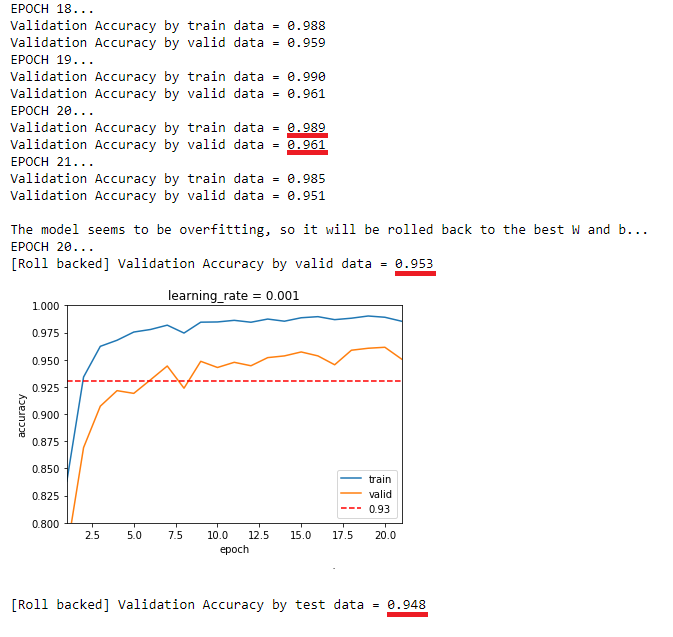

The training result  

At first, I used LeNet architecture without any changes from [CarND-LeNet-Lab](https://github.com/udacity/CarND-LeNet-Lab), and realized the model tended to be overfitting.

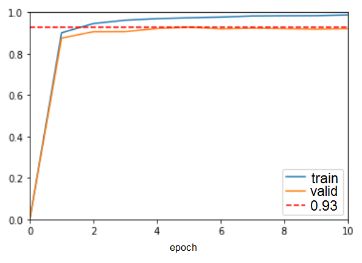

`keep_prob` = 1.0 (no *dropout*)  

So I tried to *dropout* after *max pooling* with `keep_prob` = 0.75, then there was less difference between the validation accuracy on the train dataset and by validation dataset, which meant the model was not overfitting.   

`keep_prob` = 0.75  

However, the validation accuracy on the train dataset was not sufficient, so I decided to change the model itself to the new one introduced in this article written by Alex Staravoitau, [Traffic signs classification with a convolutional network](https://navoshta.com/traffic-signs-classification/), that achieved 99.33%. The biggest difference between LeNet and the new model is that the new one combines the each convolutional layer outputs (after dropout) into the flatten layer, whereas LeNet jsut flats the outputs from the last convolutional layer. This fearture is also mentioned in this paper, [Traffic Sign Recognition with Multi-Scale convolutional Networks](http://yann.lecun.com/exdb/publis/pdf/sermanet-ijcnn-11.pdf), wiritten by Pierre Sermanet and Yann LeCun.

To find the best epochs, I ran the model with 350 epochs (it took about 6 hours with g3.4xlarg, an AWS GPU instance) and found out that the average validation accuracy on the validation dataset of this model is 96.0%.

The result with 350 epochs  

Therefore, I implemented *early training stopping* that stops training and roll Weiths and Biases back to the ones which output the best result when the validation accuracy on the validation dataset goes below the average validation accuracy, 96.0%. Although the epochs changes every time, it will settle between 20~30 epochs in most cases.

The reasons why the best validation accuracy in my code is less than the article are:

* The dataset preprocessing is different... In the article, [the train dataset is augmented by image profection](https://navoshta.com/traffic-signs-classification/#rotation-and-projection), which is not implemented in my code.
* The way of training is different... In the article, [the training and also the train dataset are divided into 2 stages with 2 kinds of learning rate](https://navoshta.com/traffic-signs-classification/#training), whereas the model is trained just 1 time with 1 kind of learning rate in my code as well as LeNet.

### Test a Model on New Images

#### 1. Choose five German traffic signs found on the web and provide them in the report. For each image, discuss what quality or qualities might be difficult to classify.

Here are five German traffic signs that I found on the web:

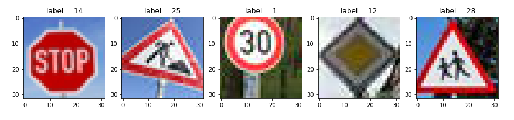

The new images from the web, the size is 32x32  

Each image might be diffcult to classify because:
1. *[14] "Stop"*... The shape of the traffic sign is close to circle, that is characteristics many othe traffic signs use as well. And *[17] "No entry"* is also fulfilled with red color.
2. *[25] "Road work"*... There are many traffic signs of this type, triangle with bold red line and some human drawing in the triangle. Thus, the shape of red triangle would be easy to find, but the key point of classifying this type is the drawing in the triangle and this would be difficult because there is only a little information.
3. *[1] "Speed limit (30km/h)"*... There are many similar traffic signs which have bold red circle and number in the circle. Same reasons as 2. *[25] "Road work"*, it might be difficult to distinguish from other *"Speed limit"*.
4. *[12] "Priority road"*... The backgrond color is same as the traffic sign.
5. *[28] "Children crossing"*... Same reason as 2. *[25] "Road work"*.

#### 2. Discuss the model's predictions on these new traffic signs and compare the results to predicting on the test set. At a minimum, discuss what the predictions were, the accuracy on these new predictions, and compare the accuracy to the accuracy on the test set (OPTIONAL: Discuss the results in more detail as described in the "Stand Out Suggestions" part of the rubric).

Here are the results of the prediction:

| Image			                   | Prediction	        			         |
|:----------------------------:|:---------------------------------:|
| *[14] "Stop"*      		       | <u>*[14] "Stop"*</u>              |
| *[25] "Road work"*     			 | <u>*[25] "Road work"*</u>		     |
| *[1] "Speed limit (30km/h)"* | [2] "Speed limit (50km/h)"        |
| *[12] "Priority road"*  		 | <u>*[12] "Priority road"*</u>	 	 |
| *[28] "Children crossing"*	 | <u>*[28] "Children crossing"*</u> |

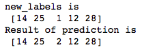

The result of predicted labels  

The model was able to correctly guess 4 of the 5 traffic signs (in the 20th cell), which gives an accuracy of 80% (in the 21st cell). This compares favorably to the accuracy on the test set of 94.8% (in the 12th cell).

#### 3. Describe how certain the model is when predicting on each of the five new images by looking at the softmax probabilities for each prediction. Provide the top 5 softmax probabilities for each image along with the sign type of each probability. (OPTIONAL: as described in the "Stand Out Suggestions" part of the rubric, visualizations can also be provided such as bar charts)

The code for making predictions on my final model is located in the 22nd cell of the Ipython notebook.

Here are the results of the top 5 predictions:

| Image	| 1st Prediction | 2nd prediction | 3rd | 4th | 5th |
|:-----:|:--------------:|:--------------:|:---:|:---:|:---:|
| *[14] "Stop"* | <u>*[14] "Stop"*</u>, 100.0% | [39] "Keep left", 0.0% | [8], 0.0% | [1], 0.0% | [17], 0.0% |
| *[25] "Road work"* | <u>*[25] "Road work"*</u>, 89.9% | [0] "Speed limit (20km/h)", 6.4% | [22], 1.8% | [20], 1.1% | [40], 0.5% |
| *[1] "Speed limit (30km/h)"* | [2] "Speed limit (50km/h)", 65.8% | <u>*[1] "Speed limit (30km/h)"*</u>, 22.8% | [12], 9.5% | [13], 1.4% | [40], 0.4% |
| *[12] "Priority road"* | <u>*[12] "Priority road"*</u>, 100.0% | [25] "Road work", 0.0% | [17], 0.0% | [40], 0.0% | [38], 0.0% |
| *[28] "Children crossing"*	| <u>*[28] "Children crossing"*</u>, 100.0% | [11] "Right-of-way at the next intersection", 0.0% | [40], 0.0% | [1], 0.0% | [36], 0.0% |

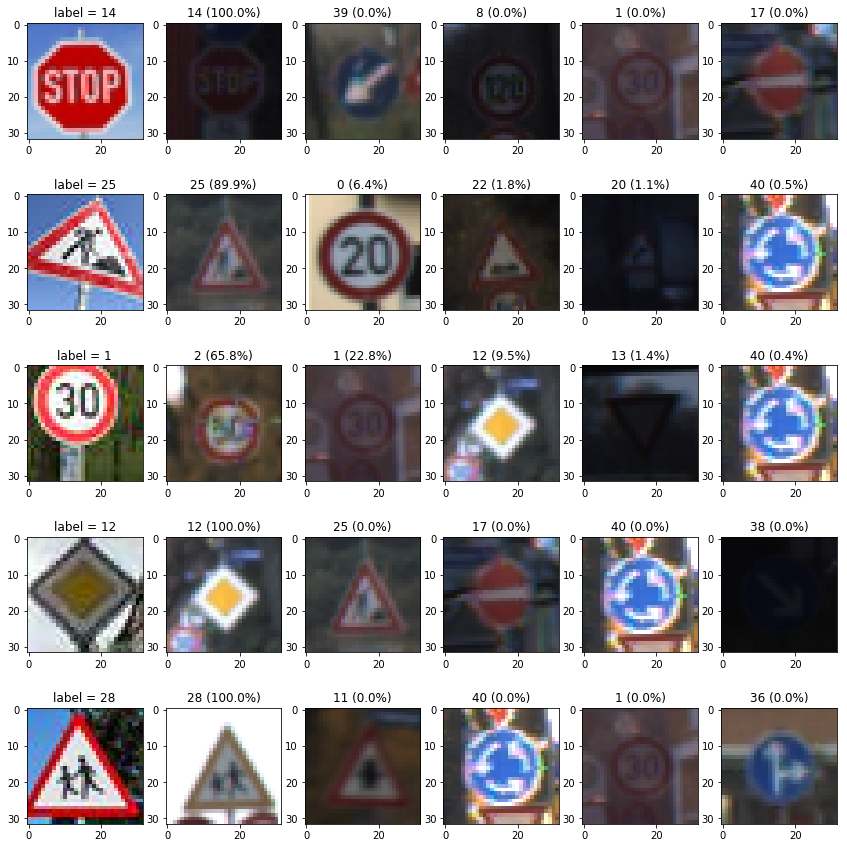

The result of prediction  

In the 3rd row of the above image, the model predicted *[1] "Speed limit (30km/h)"* as *[2] "Speed limit (50km/h)"*, which is wrong but similar. Note that the model predicted correct traffic sign, *[1] "Speed limit (30km/h)"*, in 2nd prediction. And all of these top 5 predictions have some mutual features, surrounded with bold line, surrounded with red line or circle shape.

In order to discuss about this wrong prediction, here is the distribution of the augmented train dataset that would be a key point:

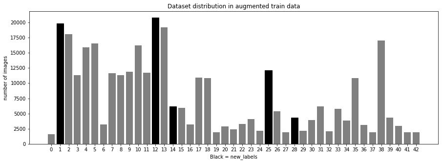

The bars highlighted with black are the number of new images  

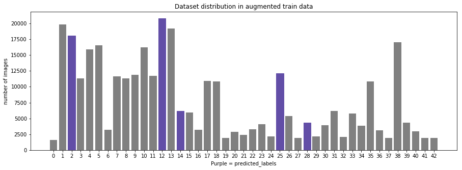

The bars highlighted with purple are the number of predicted images  

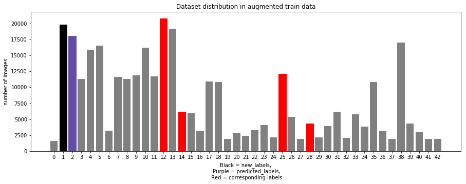

The bars highlighted with red are the number of corresponding images  

The distribution of augmented train dataset has no big difference from before augmenting. The reason is that 3 of 4 augmentation processing, *rotating* (2 kinds), *translating* (4 kinds) and *zooming* (2 kinds), were implemented to all images in the train dataset equally which came 8 times amount of images in total, whereas *flipping* processing was executed only 60% of the original train dataset which made a slight change in the distribution.

Focusing on the only wrong prediction that is label *[1]* and *[2]* in the distribution of corresponding images, the numbers of label *[1]* and *[2]* are close and both of these are high in the distribution. In addition, the number of the 3rd prediction of this incorrect prediction, which is label *[12]* (9.5%), is also close and high. Thus, one of the solutions to prevent this kind of misprediction would be augmenting the train dataset so that the distribution of the dataset become flat and [balanced](https://navoshta.com/traffic-signs-classification/#training).
